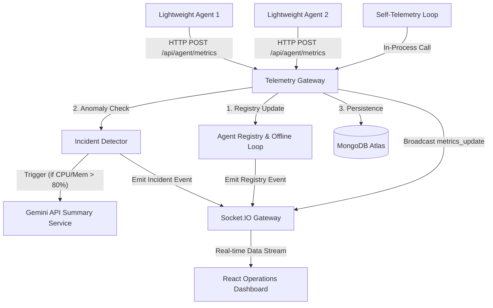

# GRIDFLOW

GRIDFLOW is a lightweight, real-time distributed infrastructure monitoring and observability platform. It is built as a TypeScript monorepo using npm workspaces, featuring low-overhead monitoring agents, a centralized telemetry gateway, and an interactive, real-time operations console.

---

## 1. Project Overview & The Engineering Problem

### The Problem
Traditional infrastructure monitoring setups (such as Prometheus with Grafana) are incredibly powerful but introduce substantial deployment complexity, resource overhead, and setup latency. For small-to-medium clusters or edge systems, spinning up a full metrics-collection stack with scraping intervals, time-series databases, and dashboard engines is often overkill and slows down developer velocity.

Furthermore, raw operational metrics (e.g., CPU load at 94% or memory utilization at 92%) lack operational context. Operators are left analyzing graphs to identify what went wrong, wasting critical seconds during outages.

### The GRIDFLOW Solution
GRIDFLOW addresses these issues by providing:
1. **Low-Overhead Telemetry Agents**: Lightweight Node.js/TypeScript daemons that extract native OS telemetry and stream metrics directly via clean HTTP POST requests.
2. **Centralized Observability Gateway**: A structured gateway that ingests telemetry, manages an active agent registry with automatic offline detection, persists metrics, and evaluates system health status thresholds.
3. **Incident Intelligence Layer**: An operational layer that flags anomalies (CPU or Memory > 80%), implements localized cooldowns to prevent alarm fatigue, and leverages the Gemini API to automatically generate plain-English diagnostic summaries of incidents.
4. **Real-time Operations Console**: A modern, responsive React/Vite dashboard powered by Socket.IO for sub-second visual updates without database querying overhead.

---

## 2. Architecture & Telemetry Pipeline

GRIDFLOW uses a decoupled architecture to separate collection, ingestion, and presentation.



### Telemetry Pipeline Lifecycle
1. **Extraction**: The telemetry daemon runs a collection routine utilizing the `systeminformation` library to fetch active CPU load, resident memory percentage, and system uptime.
2. **Ingestion & Validation**: The Telemetry Gateway receives payloads, passing them through validation middleware to ensure range limits (e.g., CPU 0-100%) and correct types.
3. **Registry Enrichment**: The incoming packet updates the in-memory **Agent Registry**, marking the agent's status (`healthy`, `warning`, `critical`), tracking its `lastSeen` timestamp, and keeping its `isOnline` status active.
4. **Incident & AI Processing**: If thresholds are crossed, an incident is registered. The Gateway calls the Gemini API (`gemini-1.5-flash`) asynchronously with metric data, compiling a concise operational summary.
5. **Real-time Broadcast**: The metric updates, alerts, and new incidents are immediately pushed to all connected operations consoles via Socket.IO.
6. **Long-term Storage**: Telemetry records and incidents are persisted in a MongoDB Atlas collection.

---

## 3. Tech Stack

- **Core Runtime**: Node.js, TypeScript
- **Backend Gateway**: Express, Socket.IO, Mongoose (MongoDB Atlas)
- **AI Engine**: Gemini API (`gemini-1.5-flash`)
- **Telemetry Agent**: `systeminformation`
- **Frontend Dashboard**: React, Vite, Tailwind CSS, Recharts, Lucide Icons

---

## 4. Monorepo Structure

GRIDFLOW is structured as a TypeScript monorepo managed under npm workspaces:

```text
gridflow/
├── apps/
│   ├── agent/                 # Telemetry agent daemon
│   │   ├── src/index.ts       # Agent lifecycle & collection logic
│   │   └── src/utils/logger.ts# Structured console logger
│   ├── api/                   # Telemetry Gateway (Express & Sockets)
│   │   ├── src/config/        # Environment and DB config
│   │   ├── src/middleware/    # Validation & Error handling middleware
│   │   ├── src/models/        # Mongoose Models (Metric & Incident)
│   │   ├── src/routes/        # REST controllers (agents, metrics)
│   │   ├── src/services/      # AI, Metrics, and Incident engines
│   │   ├── src/sockets/       # Socket.IO lifecycle manager
│   │   └── src/index.ts       # API gateway bootstrapper
│   └── web/                   # Operations Dashboard (React & Vite)
│       ├── src/components/    # Reusable UI widgets (Charts, Incident panel)
│       ├── src/services/      # Consolidated API and Socket hooks
│       ├── src/types/         # Global typescript contracts
│       └── src/App.tsx        # Dashboard shell
├── packages/                  # Extensible workspace packages
├── package.json               # Global workspace definitions
└── tsconfig.base.json         # Shares compiler rules across apps
```

---

## 5. Local Setup & Installation

### Prerequisites
- Node.js (v18+ recommended)
- npm (v9+)
- A running MongoDB Atlas cluster
- A Gemini API Key (optional, for operational summaries)

### 1. Clone & Install Dependencies
Run from the root of the monorepo:
```bash
npm install
```

### 2. Configure Environment Variables
Copy and set up environment configurations in their respective directories.

#### **Backend Gateway Configuration** (`apps/api/.env`)
Create `apps/api/.env`:
```env
PORT=3001
MONGODB_URI=mongodb+srv://<username>:<password>@cluster.mongodb.net/gridflow?retryWrites=true&w=majority
GEMINI_API_KEY=AIzaSy... # Your Gemini API key for Incident Summaries
NODE_ENV=development
```

#### **Agent Daemon Configuration** (`apps/agent/.env`)
Create `apps/agent/.env`:
```env
BACKEND_URL=http://localhost:3001
AGENT_ID=gridflow-agent-01
```

### 3. Run the Observability Stack Locally
GRIDFLOW defines package shortcuts in the root `package.json` to let you spin up components independently:

* **Start the Telemetry Gateway (API)**:
  ```bash
  npm run dev:api
  ```
* **Start the Operations Console (Web)**:
  ```bash
  npm run dev:web
  ```
* **Start the Telemetry Agent Daemon**:
  ```bash
  npm run dev:agent
  ```

### 4. Run via Docker Compose
GRIDFLOW is fully containerized and configured for production deployment. You can spin up the entire stack (web panel, API gateway, and monitoring agent) using Docker Compose.

1. **Configure Environment variables**: Create a `.env` file at the root of the project (you can copy `.env.example` as a starting point) and configure your MongoDB connection string and Gemini API key:
   ```bash
   cp .env.example .env
   ```
2. **Build and Run the containers**:
   ```bash
   docker compose up --build
   ```
3. Once running, the dashboard console will be accessible at `http://localhost:3000`, the API gateway at `http://localhost:3001`, and the telemetry agent will automatically begin streaming metrics internally to the API.

---

## 6. Docker Agent Deployment

GRIDFLOW provides a production-ready Docker image for deploying monitoring agents to any infrastructure. The agent is a lightweight Alpine-based container that streams telemetry every 5 seconds.

### One-Line Onboarding Flow

1. **Provision** — Click **New Agent** in the dashboard, assign a name, and copy the generated `AGENT_KEY`.
2. **Build** — Build the agent image once from the monorepo root:
   ```bash
   docker build -f apps/agent/Dockerfile -t gridflow-agent:latest .
   ```
3. **Run** — Deploy the container on any server:
   ```bash
   docker run -d \
     --name <agent-name> \
     --restart=unless-stopped \
     -e BACKEND_URL="https://your-gridflow-api.com" \
     -e AGENT_KEY="<your-generated-key>" \
     gridflow-agent:latest
   ```

The dashboard generates the exact command (with your key and API URL pre-filled) in the onboarding panel.

### Environment Variables

| Variable | Required | Description |
|----------|----------|-------------|
| `BACKEND_URL` | ✓ | The GRIDFLOW API endpoint (e.g., `https://gridflow-api.onrender.com`) |
| `AGENT_KEY` | ✓ | Secure key generated during agent provisioning. Never commit to version control. |

### Local vs Docker

| | Local Dev | Docker |
|---|---|---|
| Requires | Node.js 18+, monorepo cloned | Docker only |
| Command | `AGENT_KEY=... BACKEND_URL=... npm run dev:agent` | `docker run -e ... gridflow-agent:latest` |
| Use case | Development & testing | Production servers, remote hosts |

### Agent Logs

```bash
docker logs -f <agent-name>
```

Expected output:
```
[STARTUP] ✓ Agent initialized on hostname: web-server-1
[STARTUP] ✓ Backend gateway: https://gridflow-api.onrender.com
[STARTUP] ✓ Telemetry interval: 5 seconds
[TELEMETRY] ✓ Metrics sent (CPU: 45.2%, Memory: 62.8%)
```

### Multi-Host Deployment

Deploy the same image on each server with its own provisioned key:
```bash
docker run -d --name gridflow-agent-srv1 \
  -e BACKEND_URL="https://gridflow-api.onrender.com" \
  -e AGENT_KEY="<srv1-key>" \
  gridflow-agent:latest
```

All agents appear in real-time on the GRIDFLOW topology view.

---

## 7. How It Works: Deep Dive

### Real-time Telemetry Flow
Rather than continuous polling or database scraping, GRIDFLOW utilizes pushing from agents and real-time broadcasting to clients. When the agent streams data to `/api/agent/metrics`, the gateway processes it, updates the server-side registry, and immediately forwards it down the open Socket.IO connection. The dashboard receives this payload and updates the rolling chart state (restricted to the latest 20 measurements) smoothly.

### Incident Intelligence & Alarm Fatigue Cooldown
When metrics breach safe limits (CPU/Memory > 80%):
1. An incident trigger command is dispatched.
2. The incident runner checks an in-memory Map of active cooldowns. If that specific agent triggered a `HIGH_CPU` warning in the last **60 seconds**, the alert is silently dropped to prevent database pollution and dashboard spam.
3. If the cooldown is clear, the gateway invokes the Gemini API. The API processes the prompt and returns a 1-sentence analytical diagnostic explaining why the system might be failing (e.g. *"System may be undergoing heavy thread pool execution or process leaks"*).
4. The incident with its summary is persisted in MongoDB and pushed immediately to the dashboard's Incident Intelligence Board.

### Multi-Agent Observability & Registry Loop
GRIDFLOW tracks all telemetry streams inside an active **Agent Registry**. 
* On the backend, a background worker runs every 5 seconds checking agent metadata.
* If any agent's `lastSeen` timestamp exceeds **15 seconds**, its status is flagged to `isOnline: false`.
* An updated agent table is pushed to the client Operations Console immediately, rendering active vs. inactive nodes under the **Infrastructure Overview** grid.

---

## 8. Future Roadmaps

1. **Structured Metrics Downsampling**: Periodically compress old metrics records inside MongoDB into hourly averages to reduce data footprint.
2. **System Alert Webhooks**: Integrate Slack, Discord, or custom webhook endpoints to pipe critical incidents directly to operational notification spaces.
3. **Historical Metrics Queries**: Allow operators to query metrics over custom intervals (e.g., past 24 hours, past 7 days) on the charts.
